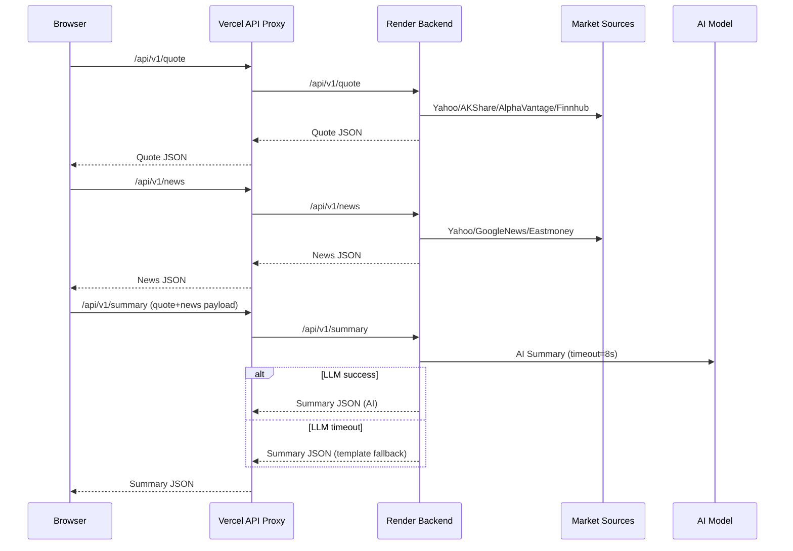

# AI Stock Research Platform 技术实现文档

## 1. 文档目标
本文件用于说明系统当前的真实实现路径、模块职责与数据流转方式，方便交接、复盘与扩展。

## 2. 项目结构

```
/ai-stock-research-platform
  /backend         FastAPI + 数据聚合 + AI 摘要
  /frontend        Next.js App Router + 分屏终端 UI
  /docs            文档
  /render.yaml     Render 部署配置
```

## 3. 前端实现路径

### 3.1 访问入口与代理链路

浏览器不直接访问 Render 后端，统一走 Vercel 同源代理：

```
浏览器 -> /api/v1/* (Next.js Route Handler) -> Render /api/v1/*
```

核心代理文件:
- frontend/app/api/v1/quote/route.ts
- frontend/app/api/v1/news/route.ts
- frontend/app/api/v1/summary/route.ts
- frontend/app/api/v1/recommendations/route.ts
- frontend/lib/backend-proxy.ts

### 3.2 页面结构

- 首页主视图: 推荐股票池 + 市场概览
- 右侧分析面板: 个股 AI 分析
- 搜索输入: 顶部全局搜索栏，按 Symbol 打开面板

核心组件:
- frontend/components/HomePageClient.tsx
- frontend/components/RecommendationsWorkspace.tsx
- frontend/components/AnalysisDrawer.tsx

### 3.3 前端分析流程

1. 用户选择股票或搜索
2. 触发 Quote + News 请求 (并发)
3. Quote + News 成功后再请求 Summary
4. Summary 超时后使用回退版本，并后台重试 AI

## 4. 后端实现路径

### 4.1 路由

核心 API:
- GET /health
- GET /api/v1/health/db
- GET /api/v1/quote
- GET /api/v1/news
- GET /api/v1/fundamentals
- GET /api/v1/announcements
- POST /api/v1/summary
- GET /api/v1/recommendations

入口:
- backend/app/main.py
- backend/app/api/v1/market.py
- backend/app/api/v1/health.py

### 4.2 行情与新闻数据源

行情聚合:
- Yahoo Finance
- Alpha Vantage (可选)
- Finnhub (可选)
- AkShare / Eastmoney (A 股)

新闻聚合:
- Yahoo Finance News
- Google News RSS
- Eastmoney News (A 股)

缓存策略:
- Quote: 60s
- News: 180s

核心实现:
- backend/app/services/market_data.py

### 4.3 基本面与公告

- 基本面: AkShare / Tushare / Yahoo
- 公告: CNINFO / Eastmoney / Tushare

核心实现:
- backend/app/services/company_data.py

### 4.4 AI 摘要链路

- 必须结合 AI
- 超时自动回退模板
- 复用前端已抓到的行情和新闻，避免重复抓取

核心实现:
- backend/app/services/summary.py

## 5. 数据流时序图 (Mermaid)



## 6. AI 摘要容错逻辑

- 前端先并发拉 quote + news
- 只有 quote + news 成功才发 summary
- summary 失败时，前端立即生成本地回退摘要
- 后台自动重试一次 AI

核心文件:
- frontend/components/AnalysisDrawer.tsx
- backend/app/services/summary.py

## 7. 部署与环境变量

### Render (后端)
- Build Command: pip install -r requirements.txt
- Start Command: uvicorn app.main:app --host 0.0.0.0 --port $PORT

环境变量示例:
- DATABASE_URL
- CORS_ALLOW_ORIGINS
- DASHSCOPE_API_KEY
- DASHSCOPE_MODEL
- ALPHA_VANTAGE_API_KEY (可选)
- FINNHUB_API_KEY (可选)
- TUSHARE_TOKEN (可选)

### Vercel (前端)
环境变量:
- NEXT_PUBLIC_API_BASE=https://ai-stock-research-platform.onrender.com

## 8. 稳定性优化策略

- 多源 fallback + TTL cache
- Summary 复用 quote/news，避免重复抓取
- Summary 强制超时并回退模板
- 前端推荐池报价逐个回填，降低峰值压力
- 代理层统一错误格式，避免 HTML 直喷 UI

## 9. 测试

- backend/tests/test_health.py
- backend/tests/test_quote.py
- backend/tests/test_summary_freshness.py

运行:

```
cd backend
.\.venv\Scripts\python.exe -m pytest -q
```

---

如需补充架构图、组件分层图或 UI 线框图，请直接说。
